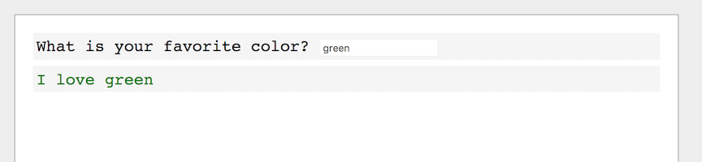
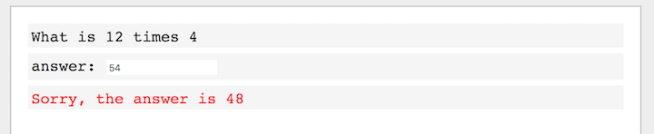

# Lesson 06 - Practice!

## Some Cool Stuff

Did you know you can pass a color as a second argument to `write`? Go ahead and try
```
write("The sky is blue", "blue")
```

There's another function that will be helpful. Try `write(random(1, 5))`. Can you figure out what it does? What if you pass in different numbers?

## Assignment - Your Favorite Color

Start a new program. Have it ask you for your favorite color, and then write a message using that color.

Here is an example:


## Assignment - Guess a number

Start a new program. Choose a random number between 1 and 10, and assign it to a variable. Ask the user to guess the number. Give the user three attempts to guess correctly. If the user guesses correctly, write "Correct!", otherwise write "Guess again.". Here is how it should look:


## Assignment - Guess a number, improved

Let's improve your Guess a Number program. When the user guesse the wrong number, you should tell them if the secret number is higher or lower.

## Assignment - Multiplication Pro

Choose two random numbers, and write them to the screen. Ask the user what the answer is when you multiply the two numbers together. If the user is correct, write a congratulatory message! If the user is wrong, tell them the correct answer.





## Assignment - Make your own progam!

Using what you know, come up with your own idea for a program, and build it!