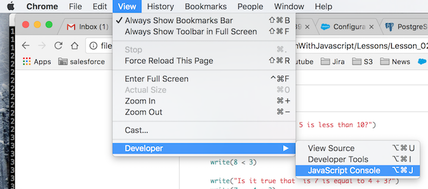
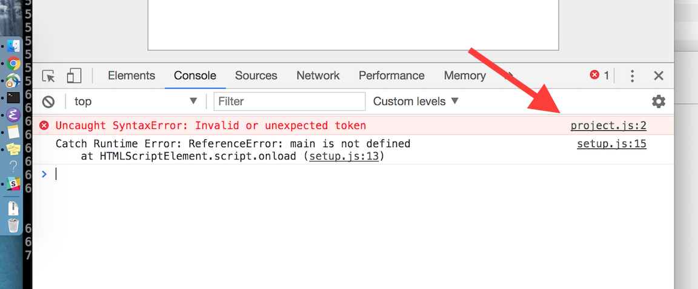

# Lesson 2: Numbers

This exercise has lots of math symbols. Let's name them right away so you know what they are called. As you type this one in, say the name. When saying them feels boring you can stop saying them. Here are the names:

- `+` plus
- `-` minus
- `/` slash
- `*` asterisk
- `%` modulo
- `<` less-than
- `>` greater-than
- `<=` less-than-equal
- `>=` greater-than-equal
- `==` equal to

Type all of the following code. DO NOT COPY AND PASTE, it is important to learn to type code. Practice makes perfect.

Before you run the code, can you predict what will appear on the screen?

```javascript
async function main() {

      write("What is 5 plus 3?")
      write(5 + 3);
      
      write("What is 12 times 2?")
      write(12 * 2);
      
      write("Wow, and what is 9812 divided by 2?")
      write(98127 / 2)

}
```

Try some more examples.

```
      write("Is it true that 5 is less than 10?")
      write(5 < 10)

      write("Is 8 less than 3?")
      write(8 < 3)

      write("Is it true that  is 7 is equal to 4 + 3?")
      write(7 == 4 + 3)

```

## Study Drills
1. Above each line, use `//` to write a comment to yourself explaining what the line does.
2. You've tried `>`, but have you tried `>=`? Can you explain how they are different? If you don't know, try some examples. 
3. Try these two examples. Can you predict the result? Can you explain why it displays what it does?
  - `write(4 + 3 * 2)`
  - `write((4 + 3) * 2)`
4. Have you been typing everything like I asked? Remember, you cannot get faster at typing unless you Practice Practice Practice!
5. What does `%` do? It's not obvious, so try some more examples.
6. Write the following line of code. Notice that this code is BROKEN (It is missing a `"`). We are intentionally writing broken code so you can see what happens when there is an error.
```
    write("Hello)
```
Refresh the page, and you should see a blank page. Open the Javascript Developer Console in Chrome by going to `View > Developer > Javascript Console`.



You should see a panel open at the bottom of the browser, with red text saying `Uncaught Syntax Error`. A syntax error is just a fancy way of saying "you typed something wrong". You should also see, to the right right, something like `project.js:2`. That's the file that contains the error, and the line number. To fix the error, go to project.js, find the line number specified in the error statement, and add a quote (`"`) in the approprate spot. Refresh the page, and the error should be fixed. 



When there is something wrong with your code, but you don't know what, it is called a "bug", and the process of finding and fixing it is called "debugging". Everybody makes mistakes (especially programmers!) and so debugging is an essential skill to learn. From now on, if your code does not work, you should open the Javascript Console and find the error.

Try `write("Another Bug"` and refresh the page. Open the Javascript Console to find the bug, and then fix it. Do you get the same error message as before, or a different one?

## Notes
1. Sometimes you'll see semicolons at the end of a line, like this `write(10);`. But other times you won't, like this: `write(10)`. Why the difference? In the early days of Javascript, the compiler required semicolons at the end of each line to figure out the coder's intention. But nowadays, our compilers are advanced enough that we no longer need semicolons at the end of lines. You may use them or not, it is your choice.

[Next Lesson](Lesson_03.md)


[Table of Contents](ToC.md)
