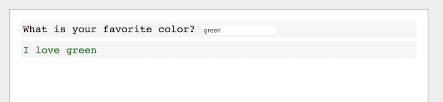
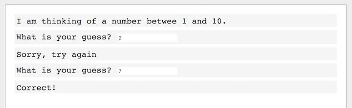
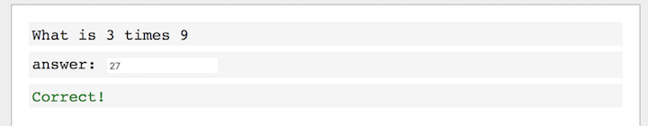
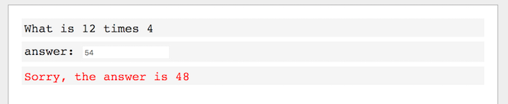
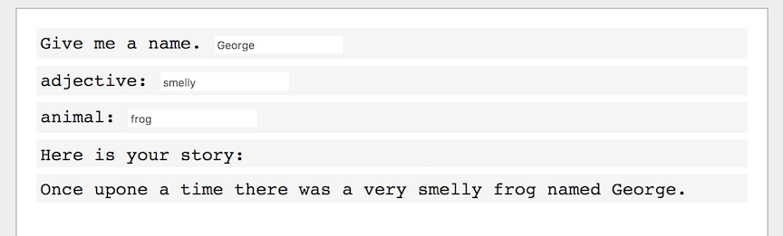

# Lesson 06 - Practice!

## Colors

You don't know this (because I've been keeping it a secret) but you can change the color of the text you write! Try this:

```
write("Roses are red", "red")
write("Violets are blue", "blue")
write("Steve knows how to code", "grey")
write("And now Daylon does too!", "green")

```

## A New File

So far you've been writing your code in `project.js`, but I want to show you how to write code in another file. Create a new file called `color.js` in the same directory as `project.js`, and write this code in it:

```
async function main() {
    write("This file is color.js");
}
```

In your web browser, your code has been running with a url like this:
```
LearnToProgramWithJavascript/index.html
```
Add `?name=color` to the url, like this:
```
LearnToProgramWithJavascript/index.html?name=color
```
If you did it correctly, you should see the message "This file is a color.js" on the screen. Good job!

From now on, when you want to create a new file (start a new program), simply add the filename to the end of the url. This will be helpful once you start creating interesting programs that you want to save. Later on, I'll even show you how to put your programs on the internet for all your friends to see!

## Assignment - Your Favorite Color

Write this assignment inside `color.js`.

Write a program that will ask you for your favorite color, and then write a message using that color.

Here is how it should look:


## Assignment - Guess a number

Start a new program called `guess` (Create a new file called `guess.js`, go to `index.html?name=guess` in your browser).

Here's a new function to try.

```
async function main() {
    var number = random(1, 5)
    write(number)
}
```

Refresh the page a few times. You'll see that `random` returns a random number between 1 and 5. If you try `random(1, 2)` you'll randomly get 1 or 2. If you try `random(1990, 2017)` you'll get a random number between, well, you get the idea.

Choose a random number between 1 and 10, and assign it to a variable. Ask the user to guess the number. Give the user three attempts to guess correctly. If the user guesses correctly, write "Correct!", otherwise write "Guess again.". Here is how it should look:



## Assignment - Guess a number, improved

Let's improve your Guess a Number program. When the user guesses the wrong number, you should tell them if the secret number is higher or lower.

## Assignment - Multiplication Pro

Start a new program called `multiply` (create a new file called `multiply.js`, in your browser go to `index.html?name=multiply`)

Choose two random numbers, and write them to the screen. Ask the user what the answer is when you multiply the two numbers together. If the user is correct, write a congratulatory message! If the user is wrong, tell them the correct answer.






## Assignment - Mad Libs

In lesson 3 you made a Mad Libs story, like so

```javascript
    var person = "Daylon";
    var adjective = "cool";
    write(`I think ${person} is ${adjective}`);
```

Now's your chance to make it even better! Instead of assigning values to the variables in the code, use `ask` to ask the user for values. And instead of one sentence like the boring example above, write a clever story. Use names, verbs, adjectives, places, numbers, nouns, and other descriptions when asking the user for input. Here's an example.



But don't give up as quickly as I did. Ask for at least 10 words, and make the story at least 5 sentences long. Once you're satisfied with your Mad Libs program, show it off to your Mom and Dad and sisters! Let them each try it and see who can create the best story!

## Assignment - Make your own progam!

Using what you know, come up with your own idea for a program, and build it!

[Next Lesson](Lesson_07.md)
